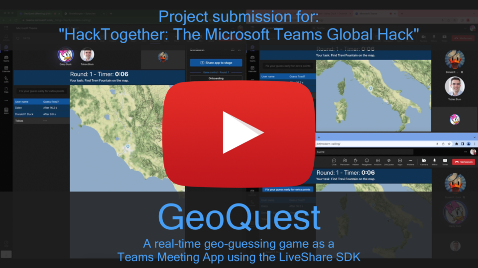

   

# GeoQuest

A fun geo-guessing game for Microsoft Teams. For example, as an icebreaker, or for small competitions during the work break.

## Demo video

##  Project summary

### What is does
The only and essential goal of this app is to have fun in a group. For example before the start of a joint meeting. Or even out of turn, if you like.
You can use it as an icebreaker, or to have a little competition about the order of speakers in a meeting. And in the end, it's just a lot of fun together.

The Teams app is based on the [LiveShare SDK](https://learn.microsoft.com/en-us/microsoftteams/platform/apps-in-teams-meetings/teams-live-share-overview?). This allows the actions of many meeting participants to be brought together in real time and displayed in a shared app experience.

After a shared onboarding phase where each player enters their name, the game is played in multiple rounds. The game leader can choose the type of questions and the map used. Then the question (e.g. "Where on the map is the Louvre?") is displayed to all players for 10 seconds. Next, there is a round of guessing in which the players have to mark the location on the map with a pin, as accurately as possible. When the players are sure, they mark their guess as final. Afterwards, the points (from accuracy of the tip and the required time) are calculated and the next round can start.

### Inspiration
During the Covid-19 lockdown, we started as a team to begin our meetings with an icebreaker, or to play a little online game during virtual lunch breaks together. We always had a lot of fun playing a geo guessing game online live against each other. Unfortunately, something like that didn't exist as a teams app until that point.
When the LiveShare functions were made available to developers, the idea came up very quickly to implement such a game with the new technology in order to gain experience with it, to demonstrate the possibilities of the technology and to bring a little fun into the meetings.

## About the project

### What it is - _Type of the project_
This project is a Teams meeting app. The app can only be added to meetings. There it is available as an icon and the game leader can then open it, whereupon the control panel is then available in the sidebar. The game master then shares the app with all participants on the stage.

### How it works - _Technology_
The app is a minimal Teams app and uses the LiveShare SDK. It is based on a simple Vite project using React and TypeScript. The UI was built using Fluent UI 9 and SASS.

Since the focus is on using the LiveShare SDK, the Teams app was deliberately implemented as simple as possible (static web app and a matching Teams manifest). This allows for a hassle-free installation and since no communication with other Microsoft 365 services is required, no authentication flow needs to be implemented.
For more complex scenarios, it is of course possible to use the Teams Toolkit, and this solution can also be migrated to it later without any problems if the additional features of the framework are ever needed.

### How to use it - _Installation_
To make the app as easy to use as possible, we set up an automatic deployment of the app via GitHub Action to an Azure Static Web App. From there, it can be used directly. We provide the suitable manifest for download [here](https://github.com/nmtoblum/live-share-geoquest/releases/download/latest/production.zip). This allows the app to be easily installed in the tenant or side-loaded directly into a meeting. That's it!
> :warning: Please use this package and hosted version only for trying it out and/or demoing the solution. We do not guarentee that it will work forever. Deploy your own version if you want to use it regularly.

## About us

### Who we are
- [Tobias Blum](https://linkedin.com/in/tobiasblum) ([nmtoblum](https://github.com/nmtoblum)) - Senior Developer & Microsoft 365 architect
- [Ruslan Schuh](https://linkedin.com/in/ruslan-schuh) ([ruslan-s](https://github.com/ruslan-s)) - Senior Developer

### What we learned
- Building a Teams app is super easy, when you know how to build web apps. Just add a manifest and you're done!
- Making your web app real-time is also super easy. The [Azure Fluid Relay](https://azure.microsoft.com/products/fluid-relay) service brings everything you need to build real-time experiences.
- Making your Teams app real-time is even more simple, because the [LiveShare SDK](https://github.com/microsoft/live-share-sdk) brings everything you need. No need to book Azure services and complicated deployments. Everything is already there and it's free to use.
- The LiveShare (core) SDK abstracts much of the complexity that implementations with Azure Fluid Relay entail. However, all native Fluid objects can still be used if needed.
- The [live-share-react](https://github.com/microsoft/live-share-sdk/tree/main/packages/live-share-react) library (preview)  reduces the complexity even more.
- The support by Microsoft for the LiveShare SDK is great! Thanks [@ryanbliss](https://github.com/ryanbliss) for the [help](https://github.com/microsoft/live-share-sdk/issues/574).

## FAQ

### License
The project is [licensed](LICENSE) under "Mozilla Public License Version 2.0".

### Contributing / Minimal Path to Awesome
Contributions are always welcome as pull requests. To run a local copy of this project, so the following:

- Clone this repository
- Make sure you're using node.js 16 or 18
- In the command line run:
	- `cd client/`
	- `yarn` or `npm i` (if you're using npm)
	- `yarn dev` or `npm run dev` (to start local dev server on port 3000)
- Start a tunneling service like [ngrok](https://ngrok.com/), the new [dev tunnels](https://learn.microsoft.com/en-us/azure/developer/dev-tunnels/cli-commands) by Microsoft (tunnels can keep their hostnames for up to 30 days for free), ... or start the project in [GitHub Codespaces](https://github.com/features/codespaces) (public URL of the codespace is static as long as you don't delete the codespace) and make the port public. It doesn't matter which tool you choose, you should now have a publically available https URL.
- Now edit the DEV [manifest.json](manifest/DEV/manifest.json) and replace the domain in `configurationUrl` and `validDomains` with your public hostname from the step below.
- Now run `yarn manifest` or `npm run manifest`. You should find your Teams App package under the path `manifest/dev.zip`.
- Start a new meeting in Teams (a meet-now meeting does also work) and sideload the app package directly into the meeting.
- Now you can add the app "GeoQuest" the the meeting.

### Problems & other questions
Feel free to [open an issue](https://github.com/nmtoblum/live-share-geoquest/issues/new) if you have problems using this app or have other questions.